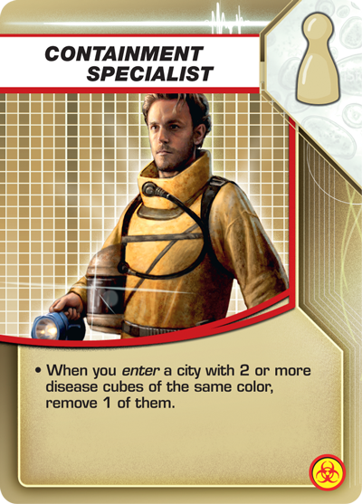

# The Containment Specialists
An open source design for digital contact tracing

# Problem Statement
In 2020, the Covid 19 pandemic has caught us all off guard. Contact tracing is an effectice offline method of reducing the spread of a contagion. [Apple and Google are working together](https://www.theverge.com/interface/2020/4/11/21216652/apple-google-contact-tracing-covid-19-coronavirus-api-public-health-app-challenges) on contact tracing APIs, with system level implementation to follow. Effectice product and service design around these APIs could:

- Assist in-person contact tracing groups
- Drive adoption of contract tracing technology
- Inform other designers & developers on best practices for digital contact tracing apps
- Inform Apple & Google's system level contact tracing integration
- Create an effective accepted for this pandemic and future ones

# Contributing to this project
## Submissions
Pull requests will be reviewed within a week and approximately based on their relevance to the **Problem Statement.** All types of submissions are welcomed from any party. I expect to spend approximately 4-8 hours a week on this project. Please confine communication about this project to this repository. Contributor coordination by other methods is fine. (ex. I will email/text the first round of contributers to ask for submissions)

To me, it makes sense to use Google Docs to manage some artifacts to enable real time collaboration. If this project becomes large enough, it may need to move back to having all files managed on Github. I'm open to all suggestions on process for managing this project. 

## Tools
Feel free to use your tool of choice to create artifacts for this project, keeping in mind that there needs to be an easy way for others to edit and copy it. Generally the more adoption, easier to use better. Some tools I like: Sketch, Invision, Framer, Google Docs

## Submission Resources
As designers Github can sometimes be confusing, please review the basic guidelines on how to make submissions here:
https://guides.github.com/activities/hello-world/

Guide to Markdown (how to style this document)
https://www.markdownguide.org/cheat-sheet/

# Other Resources
## What is Contact Tracing?
https://en.wikipedia.org/wiki/Contact_tracing

## Digital Contact Tracing
https://techcrunch.com/2020/04/18/what-is-contract-tracing/

## Documentation
https://www.apple.com/covid19/contacttracing

https://www.blog.google/documents/57/Overview_of_COVID-19_Contact_Tracing_Using_BLE.pdf

## People
[Pan-European Privacy-Preserving Proximity Tracing](https://www.pepp-pt.org)

# Roadmap
## In Progress
- Digital Ethnography Study on In Person Contact Tracing
- Resource Gathering
- Contributer Recruitment

## Current Needs 
- User Research
- Competitive Analysis

## Future Needs 
- Customer Journeys
- Service Design Blueprint
- Job Stories
- Wireframes
- Prototypes
- User Testing
